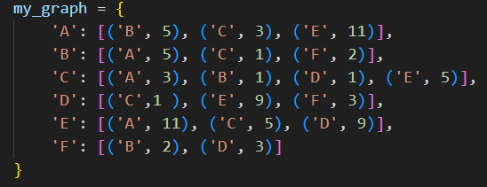
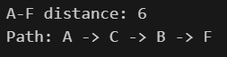

# Finding The Shortest Path Using Dijkstra Algorithm
Ever wondered how Google Maps magically finds the fastest route while you're rushing for a meeting? That’s basically `Dijkstra’s Algorithm` in action. It’s a smart way to find the shortest path between two points in a messy web of connections (a graph).

----

The main script is based on freeCodeCamp Scientific Computing with Python curriculum. This project is about how Python handles complex logic, using dictionaries to store distances and lists to track unvisited nodes.

## Features
* **Weighted Graph Support**: Handles connections between nodes that have specific "costs" or distances (not just simple 1-to-1 steps).
* **Dynamic Start & End Points**: You can define any node as your starting point and specify a target destination or calculate paths to everything at once.
* **Path Tracking**: It doesn't just tell you how far it is, it reconstructs the exact sequence of nodes to get you there.
* **Flexible Data Structure**: Uses a Python dictionary (adjacency list), making it easy to swap out the graph data without touching the core logic.

## Project Structure
Inside this repository, you will find:
* `dijkstra.py` — The main Python script that runs Dijkstra Algorithm.
* `README.md` — The documentation you are reading right now.
* `graph_visual.jpeg` — Just a pic of my note visualizing the graph :)
* `graph.png` — A screenshot of my graph (just an example for the output)
* `output.png` — A screenshot that shows what happen if you run the code on the terminal.

## Things I have learned from this project:
* **About Dijkstra**: Basically, Dijkstra is like a super-efficient scout. Instead of wandering aimlessly, it systematically finds the shortest path from a starting point to every other node in a network.

* **Graph and Algorithm**: I learned by visualizing the basic logic (Nodes & Edges)  
&nbsp;&nbsp;&nbsp;&nbsp;  

    * Nodes (the dots): These are the destinations, just like cities on a map, routers in a network, or people in a group.
    * Edges (the lines): These are the connections, like the roads, the cables, or the friendships that link the nodes together.

    * Dijkstra’s algorithm is basically just a very smart traveler moving across these edges to find the most efficient way to visit all the nodes. And in my opinion, visualizing the logic made the code so much easier to write.
  
* **Dictionary** `{}`: Dictionary is like a storage box and everything inside it has a specific tags. The tags are `keys`and the contents inside the box are `values`.

* **Dict Comprehension**: Comprehension makes the code more readable and cleaner. And I learned that dict comprehension can also be used in `if/else` conditions.   

## How The Logic Works
1. **The Setup (Initialization)**: Before moving, the script sets the stage:
    * It marks the distance to your starting node as 0.
    * It sets the distance to every other node as "infinity" ($\infty$) because we haven't discovered them yet.
    * All nodes are added to an unvisited list.

2. **Finding the "Current" Best Node**: The algorithm always looks at the nodes it can "see" and picks the one with the shortest known distance from the start. In the first round, this is always your starting node.

3. **Checking the Neighbors**: Once it picks a node *(let's call it current)*, it looks at all its neighbors. For each neighbor, it calculates `New Potential Distance = (Distance to current) + (Weight of the edge to the neighbor)` and if this new distance is smaller than the distance previously recorded for that neighbor, the script updates it. It’s essentially saying, *"Hey, I found a shortcut to get here!"*

4. **Updating the Map (Path Tracking)**: Whenever a shorter distance is found, the script updates the paths dictionary. It copies the journey taken to reach the current node and adds the neighbor’s name to the end of that list.

5. **Rinse and Repeat**: The current node is marked as visited (removed from the unvisited list) so we don't double-back. The process repeats until every node has been visited or the target has been reached.

6. **The Result**: Finally, the script prints out the total distance and the step-by-step path `(e.g., A -> C -> B -> F).`   

## How It Looks In The Terminal
For an example, I added this graph and my I set my `target` to `F`   

The output:  

